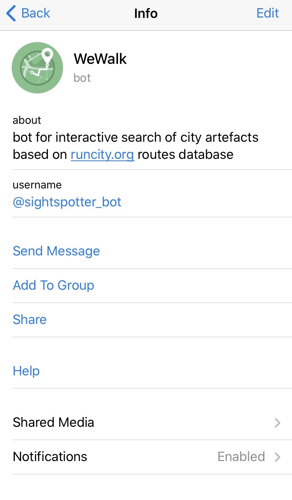

# sightspotter

Telegram bot for interactive search of the city artifacts based on runcity.org routes database. 
Discover your city while completing small tasks.

## How to start

Just go to the Telegram app on your device and find a bot named **@sightspotter_bot**

 

  

## How to use

After adding the bot and pressing start, it requests you to share your current location. 
You can send it by pressing the button at the bottom of the screen. 

After bot has received your location, it will search for the nearest sights around you and
send you the address and description of the task you have to complete.    

Following the received instruction you will discover some historical spots hidden from the touristic eye.
Keep walking and enjoy the city. 

 

  

